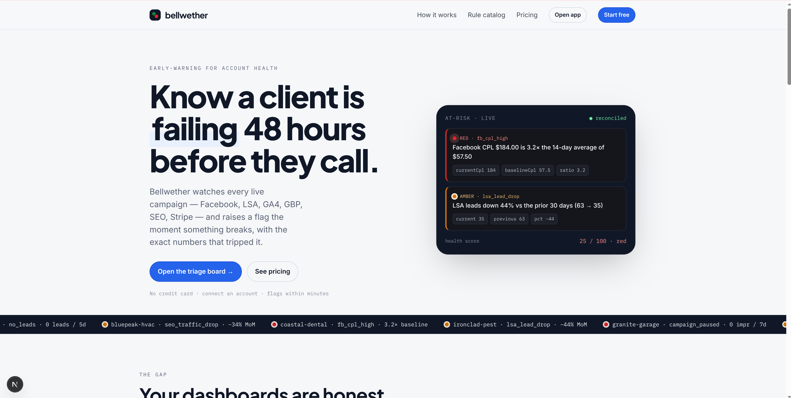
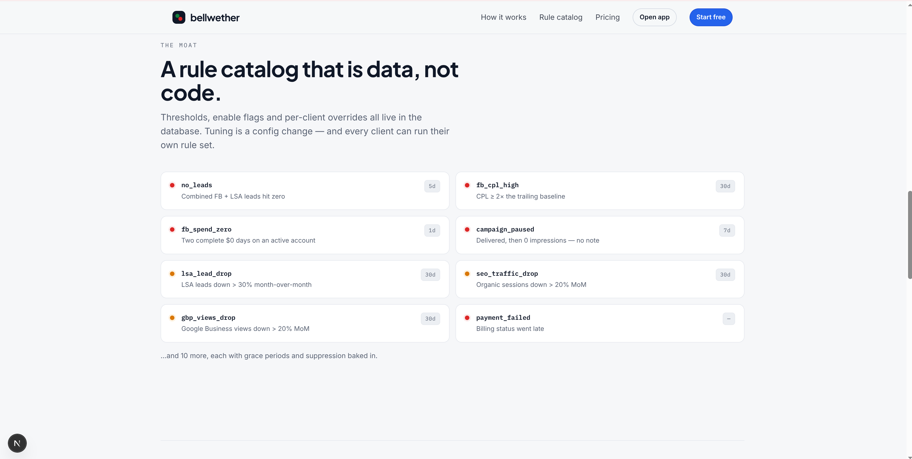
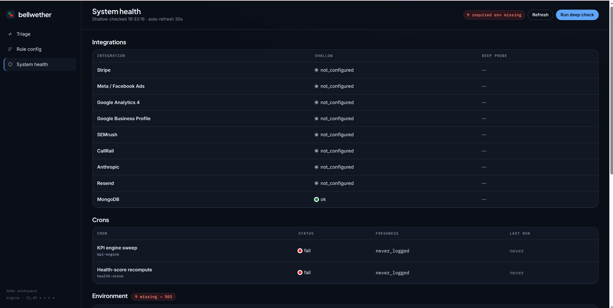
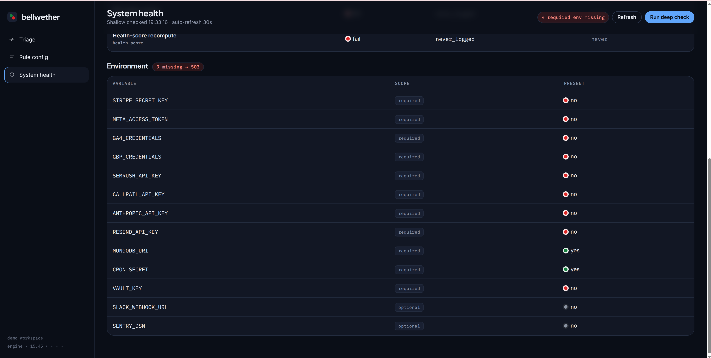
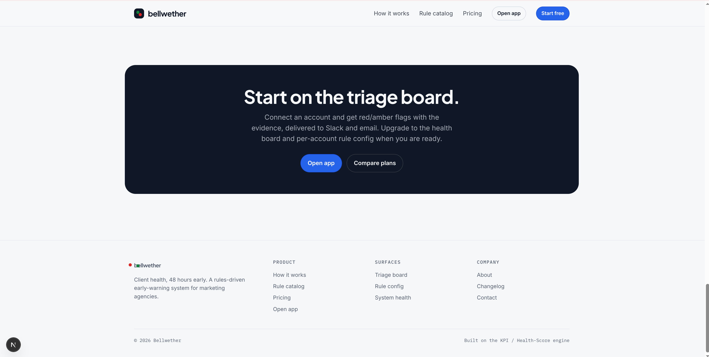

<div align="center">

# Bellwether

### Client health, 48 hours early.

**A rules-driven early-warning system for marketing agencies.**
Catch a client's failing campaigns *before they call* — red/amber flags with the exact evidence that tripped them, rolled into a portable 0–100 health score.

[](https://nextjs.org/)
[](https://react.dev/)
[](https://www.typescriptlang.org/)
[](https://www.mongodb.com/)
[](#testing)
[](LICENSE)

[**Live demo**](#quickstart) · [**How it works**](#how-it-works) · [**The rule catalog**](#the-rule-catalog) · [**Architecture**](docs/ARCHITECTURE.md) · [**API**](docs/API.md)

<br/>



</div>

---

## The problem

Your dashboards are honest. They just tell you too late.

By the time a monthly report shows the dip, the client has already noticed — and by then you're on the back foot. Agencies lose accounts not because the work is bad, but because nobody caught the *break* in time: a Facebook campaign that quietly paused, a Local Services CPL that doubled overnight, a Stripe charge that failed, organic traffic sliding a little further every week.

**Bellwether is Gainsight for marketing campaigns.** It watches every live signal — Facebook Ads, Google Local Services, GA4, Google Business Profile, SEO ranks, Stripe billing — and raises a flag the moment something breaks, carrying the exact numbers, thresholds and grace periods that tripped it. Those flags roll into a single 0–100 health score per client, driving a worst-first triage board your team actually works down.

<div align="center">

> **Lead time: 24–48h** · **6 signals watched** · **6 false-positive guards** · **25 tunable rules**

</div>

---

## A look around

<table>
<tr>
<td width="50%" valign="top">

**The rule catalog is data, not code**
Thresholds, enable flags and per-client overrides all live in the database — tuning is a config change, not a deploy.



</td>
<td width="50%" valign="top">

**System health — nothing hides**
Every integration, cron and env var, checked live. A failing connector or a stale cron shows up here before it corrupts a flag.



</td>
</tr>
<tr>
<td width="50%" valign="top">

**Env & config, fail-closed**
Missing a required secret? The app reports `503` rather than running half-blind — and tells you exactly which var is absent.



</td>
<td width="50%" valign="top">

**Start on the triage board**
Connect an account, get red/amber flags with the evidence, delivered to Slack and email.



</td>
</tr>
</table>

> 📸 More screenshots (and a capture guide) live in [`docs/screenshots/`](docs/screenshots/).

---

## Why it's different

Most "alerting" tools fire on a threshold and call it a day. Bellwether is built around three ideas that make its flags *trustworthy enough to act on*:

### 1. A failure never trips a flag (the three-state read)

This is the core invariant. **Every external metric read is one of three distinct states:**

| State | Meaning | What the engine does |
|-------|---------|----------------------|
| **present** | Real data — *including an authoritative `0`* | Evaluate the rule normally |
| **absent** | Account not connected | Skip — there is nothing to evaluate |
| **error** | A `403`, timeout, or `500` from the connector | **Throw → skip that client's affected rules** |

A connector failure must **never** silently become `"0 leads"` and open a false red. That's the difference between a flag your team trusts and one they learn to ignore. Every read in the engine is wrapped in a per-read guard, and there is a **failure-path test for every read**.

```ts
const fb = await source.fb(clientId, window)
// present → real data (a true 0 is real, and will be evaluated)
// absent  → not connected → skip this rule for this client
// error   → throws → engine drops every rule that depends on FB, for this client only
//
// A 403 never becomes "0 leads".
```

### 2. Six guards against crying wolf

Curated thresholds are only half the battle — the other half is *not* flagging things that don't matter. Baked into the engine:

- **Account-age grace** — a brand-new account isn't judged on windows it hasn't lived through yet.
- **Zero-baseline guard** — percentage-change math returns `null` when the baseline is `≤ 0` (no divide-by-zero fake spikes).
- **Minimum-baseline-leads** — CPL/lead-drop rules won't fire off a statistically meaningless handful of leads.
- **Supporting-metric suppression** — a symptom flag stays quiet when the root-cause flag is already open.
- **Seasonal hold** — configurable windows (e.g. an HVAC winter lull) suppress expected dips.
- **Note suppression** — an operator's "known / expected" note silences a flag without deleting the signal.

### 3. The rule catalog is *data, not code*

Thresholds, enable flags, severities and windows all live in the database. Tuning is a config change, not a deploy — and **every client can run their own rule set.** Start from a shared global catalog, then override any threshold, or enable/disable any rule, for a single client. A seasonal HVAC account and a steady law firm shouldn't answer to the same numbers.

---

## How it works

```
                        ┌──────────────────────────────────────────────┐
   every 30 min  ─────► │  1. EVALUATE                                  │
   (:15, :45)           │  Run each enabled rule against each client's  │
                        │  rolling 30-day windows — gated on the        │
                        │  services they actually hold live.            │
                        └───────────────────┬──────────────────────────┘
                                            │
                        ┌───────────────────▼──────────────────────────┐
                        │  2. RECONCILE (idempotent)                    │
                        │  A trip opens a flag with evidence. A         │
                        │  recovered condition auto-resolves. Keyed on  │
                        │  (client_id, source) → never double-counts,   │
                        │  never auto-merges. Snoozes reopen on expiry. │
                        └───────────────────┬──────────────────────────┘
                                            │
                        ┌───────────────────▼──────────────────────────┐
                        │  3. ROUTE                                     │
                        │  Red flags live-ping the responsible dept     │
                        │  lead (FB / LSA / SEO), falling back to       │
                        │  super-admins, deduped. Amber → digest.       │
                        └───────────────────┬──────────────────────────┘
                                            │
   daily 03:00  ──────► ┌───────────────────▼──────────────────────────┐
                        │  4. SCORE                                     │
                        │  Open flags + billing + recency roll into a   │
                        │  0–100 health score, banded green/amber/red,  │
                        │  driving the worst-first triage board.        │
                        └──────────────────────────────────────────────┘
```

### The health score

A transparent, portable formula — every deduction is visible on the client detail page:

| Component | Penalty | Cap |
|-----------|---------|-----|
| Red flags | −20 each | −40 |
| Amber flags | −8 each | −24 |
| Billing late | −15 | — |
| No touch > 30 days | −10 | — |
| No touch > 60 days | −20 | — |

`score = clamp(0, 100, 100 − deductions)` → **green ≥ 80 · amber ≥ 50 · red < 50**

### Routing

| Flag source | Goes to |
|-------------|---------|
| `fb_*`, `campaign_paused` | Facebook Ads lead |
| `lsa_*` | LSA lead |
| `seo_*`, `gbp_*` | SEO lead |
| `no_leads`, `payment_failed`, `access_lost` | Super-admins |

Red flags ping live (deduped so the bell never spams); amber collects into a digest.

---

## The rule catalog

25 rules ship in the seed catalog. A representative slice:

| Rule | Severity | Window | Fires when |
|------|:--------:|:------:|------------|
| `no_leads` | 🔴 red | 5d | Combined FB + LSA leads hit zero |
| `fb_cpl_high` | 🔴 red | 30d | Facebook CPL ≥ 2× the trailing baseline |
| `fb_spend_zero` | 🔴 red | 1d | Two complete $0 days on an active account |
| `campaign_paused` | 🔴 red | 7d | Delivered, then 0 impressions — no note |
| `payment_failed` | 🔴 red | — | Billing status went late |
| `access_lost` | 🔴 red | — | Platform access revoked or expired |
| `lsa_lead_drop` | 🟠 amber | 30d | LSA leads down > 30% month-over-month |
| `lsa_cpl_up` | 🟠 amber | 30d | LSA cost-per-lead up > 40% MoM |
| `seo_traffic_drop` | 🟠 amber | 30d | Organic sessions down > 20% MoM |
| `gbp_views_drop` | 🟠 amber | 30d | Google Business views down > 20% MoM |
| `fb_ctr_low` | 🟠 amber | 7d | Facebook link CTR below the floor |

…each with grace periods, baselines and suppression built in. Every threshold in the `config` column is editable per-client. See [`src/lib/seed.ts`](src/lib/seed.ts) for the full catalog.

---

## Quickstart

**Prerequisites:** Node 20+, a running MongoDB (local `mongod` or Atlas).

```bash
# 1. Install
npm install

# 2. Configure — copy the example and point MONGODB_URI at your database
cp .env.example .env

# 3. Create the schema (validators + indexes, in the mandated order)
npm run migrate

# 4. Seed the rule catalog + a curated demo roster (10 clients, real-looking flags)
npm run seed          # 25-rule global catalog
npm run seed:demo     # demo clients you can click through immediately

# 5. Run it
npm run dev           # → http://localhost:3000
```

Then open:

- **`/`** — the marketing landing page
- **`/app`** — the triage board (demo data shows 1 red / 2 amber / 7 green)
- **`/app/rules`** — the rule catalog & per-client overrides
- **`/app/system`** — the System Health dashboard

`.env` needs just two things to run locally:

```dotenv
MONGODB_URI=mongodb://127.0.0.1:27017
MONGODB_DB=kpi_engine
CRON_SECRET=dev-cron-secret-change-me   # both crons fail closed without this
```

### Running the engine manually

The crons are plain authenticated GET endpoints — trigger them by hand:

```bash
# Evaluate rules + reconcile flags
curl -H "Authorization: Bearer $CRON_SECRET" http://localhost:3000/api/cron/kpi-engine

# Recompute all health scores
curl -H "Authorization: Bearer $CRON_SECRET" http://localhost:3000/api/cron/health-score
```

On Vercel these run automatically — see [`vercel.json`](vercel.json).

> **Cron cadence and the Vercel Hobby plan.** The engine is designed to sweep every 30 minutes (`15,45 * * * *`), which is the cadence the architecture docs describe. Vercel's Hobby plan permits only one cron run per day, so `vercel.json` ships daily schedules (`0 2 * * *` and `0 3 * * *`) to keep the repo deployable as-is. On Pro, restore `15,45 * * * *` and leave `KPI_ENGINE_INTERVAL_MINUTES` unset.
>
> That env var exists because the schedule and the thing that *judges* the schedule have to agree: System Health marks a cron stale after `min(3 × interval, interval + 48h)`, so a hardcoded 30-minute interval would report a correctly-running daily cron as a red failure. The interval is configuration, not a constant.

---

## Connecting your own metrics

Out of the box the engine ships with **no live connectors** — which means every read is `absent` and no flags fire (never a false zero). You plug in your data by implementing one interface:

```ts
export interface KpiMetricSource {
  fb(clientId, window):  Promise<FbMetrics | null>       // null = not connected; throw = error
  lsa(clientId, window): Promise<LsaMetrics | null>
  ga4Aggregate(window):  Promise<Map<string, Ga4Metrics>>  // missing key = absent
  gbpAggregate(window):  Promise<Map<string, GbpMetrics>>
  seoRanks(clientId):    Promise<SeoRankRow[] | null>
}
```

The `SuppliedMetricSource` helper lets you back the engine with a partial set — provide only the reads you have; the rest default to `absent`. Honour the contract: **return `null` for not-connected, and `throw` for a real error.** That single discipline is what keeps every downstream flag trustworthy.

```ts
// src/app/api/cron/kpi-engine/route.ts — plug your layer here
const metricSource = new SuppliedMetricSource({ fb, lsa, ga4Aggregate, gbpAggregate, seoRanks })
```

See [`src/lib/metric-source.ts`](src/lib/metric-source.ts) for the full contract and types.

---

## Tech stack

| Layer | Choice |
|-------|--------|
| Framework | **Next.js 16** (App Router, Turbopack) |
| UI | **React 19**, CSS custom-property design system (no component library) |
| Language | **TypeScript 5** (strict) |
| Data | **MongoDB 6** — `$jsonSchema` validators + partial unique indexes |
| Validation | **Zod 4** on every write route |
| Tests | **Vitest** — 72 tests, live-mongo integration + pure-logic units |

> **Note on MongoDB:** this build swaps the spec's Postgres/Supabase layer for MongoDB. CHECK constraints become `$jsonSchema` validators; partial unique indexes are preserved 1:1 (e.g. *one open flag per `(client_id, source)`*). Row-Level Security has no MongoDB equivalent — **multi-tenant isolation is enforced at the application layer** and is documented, not silent. See [`docs/ARCHITECTURE.md`](docs/ARCHITECTURE.md).

---

## Project structure

```
src/
├─ app/
│  ├─ (marketing)/          # landing + pricing (static)
│  ├─ app/                  # the product: triage, clients, rules, system
│  └─ api/                  # cron, kpi-flags, rules, system-health routes
├─ components/
│  ├─ app/                  # triage UI, flag list, rule editors
│  ├─ site/                 # marketing nav + footer
│  └─ SystemHealthDashboard.tsx
└─ lib/
   ├─ kpi-engine.ts         # the rule engine (evaluate → reconcile → route)
   ├─ kpi-engine-logic.ts   # pure helpers (baselines, grace, seasonal)
   ├─ health-score.ts       # the 0–100 score
   ├─ rules.ts              # global + per-client rule resolution
   ├─ metric-source.ts      # the three-state read contract
   ├─ schema.ts             # MongoDB validators + indexes
   ├─ health/               # System Health monitor (env / crons / pings)
   └─ ...
scripts/  migrate.ts · seed.ts · seed-demo.ts
test/     72 tests (unit + live-mongo integration)
```

Full walkthrough in [**docs/ARCHITECTURE.md**](docs/ARCHITECTURE.md).

---

## Testing

```bash
npm test          # 72 tests, one run
npm run test:watch
npm run typecheck # tsc --noEmit, strict
```

The suite enforces the two non-negotiable invariants:

- **A failure-path test for every external read** — proves a connector error never becomes a `0`.
- **A test per product guarantee** — idempotent reconcile, no double-counting, guards refuse rather than degrade.

Integration tests run against a live `mongod` on `127.0.0.1:27017` using a throwaway `kpi_engine_test` database (see [`test/setup.ts`](test/setup.ts)).

---

## Security & production notes

This is a working product core, not a turnkey SaaS. Before shipping to real tenants:

- 🔒 **Auth is a stub.** [`src/lib/auth/access.ts`](src/lib/auth/access.ts) reads identity from `x-user-*` headers to keep the route contracts honest. **Replace it with real session/JWT verification.**
- 🔒 **Multi-tenant isolation is app-level.** MongoDB has no RLS — enforce org scoping in queries.
- 🔒 **The deep system-health probe is unauthenticated.** Gate `/api/system-health/deep` before production.
- ✅ **Crons already fail closed** — no `CRON_SECRET`, no run (`401`).

---

## Roadmap

- [ ] Live connectors (Facebook, Google Ads/LSA, GA4, GBP, Stripe) behind the `KpiMetricSource` contract
- [ ] Real authentication + org-scoped multi-tenancy
- [ ] Slack / email digest delivery for amber flags
- [ ] Historical health-score charting on the client detail page
- [ ] Rule-authoring UI for custom rules (beyond overriding the catalog)

---

## Contributing

Contributions welcome — see [CONTRIBUTING.md](CONTRIBUTING.md). The golden rule: **never let an external failure degrade into a fabricated value, and add a failure-path test for every new read.**

## License

[MIT](LICENSE) © 2026
